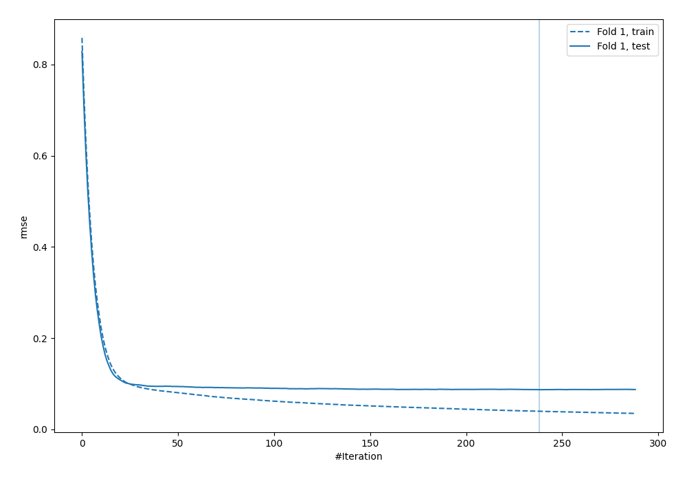
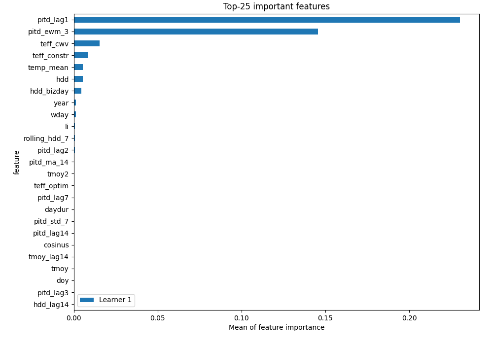

# Summary of 10_Xgboost

[<< Go back](../README.md)

## Extreme Gradient Boosting (Xgboost)
- **n_jobs**: -1
- **objective**: reg:squarederror
- **eta**: 0.15
- **max_depth**: 8
- **min_child_weight**: 50
- **subsample**: 0.6
- **colsample_bytree**: 0.6
- **eval_metric**: rmse
- **explain_level**: 1

## Validation
 - **validation_type**: split
 - **train_ratio**: 0.8
 - **shuffle**: False

## Optimized metric
rmse

## Training time

1.9 seconds

### Metric details:
| Metric   |           Score |
|:---------|----------------:|
| MAE      | 13750.6         |
| MSE      |     4.05489e+08 |
| RMSE     | 20136.7         |
| R2       |     0.991949    |
| MAPE     |     0.0499059   |

## Learning curves

## Permutation-based Importance

## True vs Predicted

## Predicted vs Residuals

[<< Go back](../README.md)
