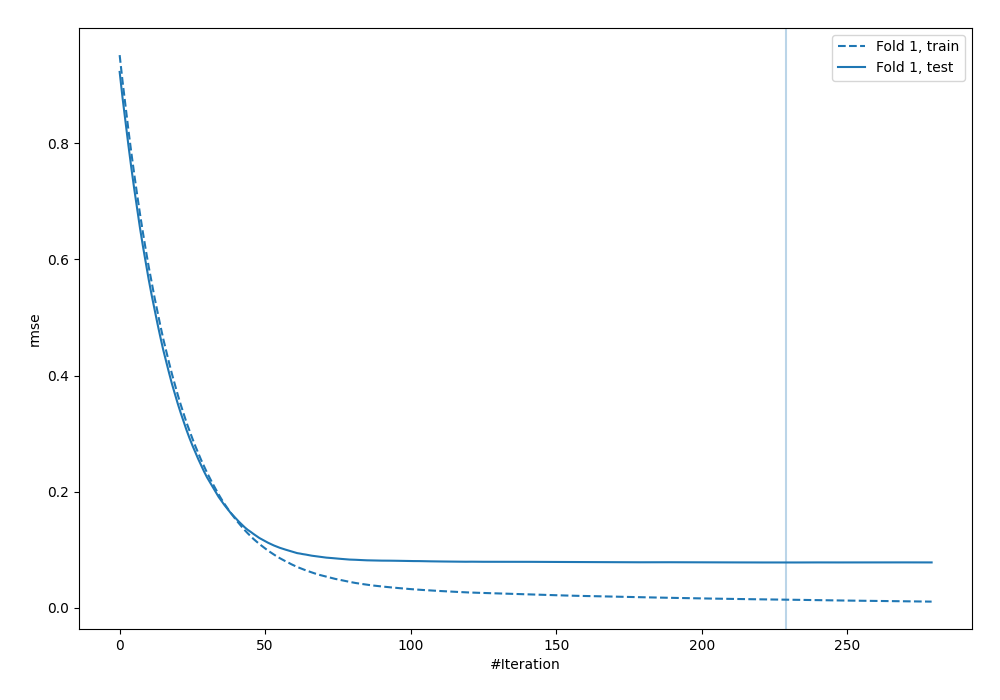
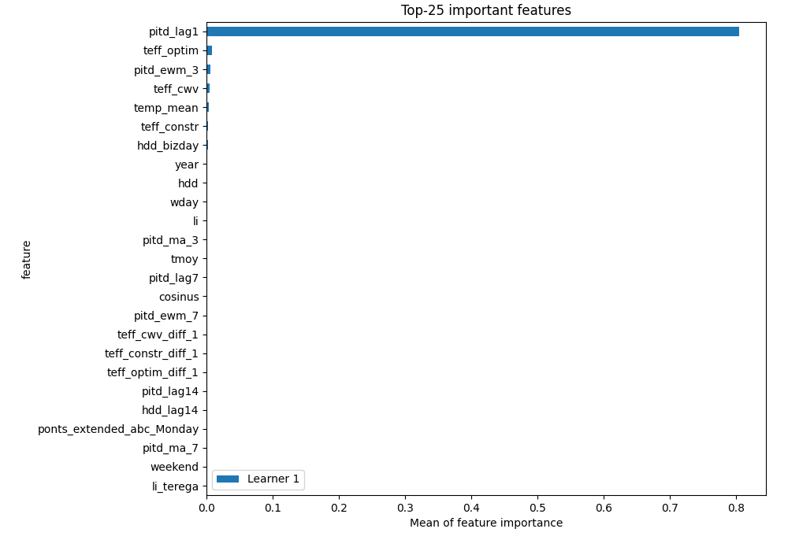
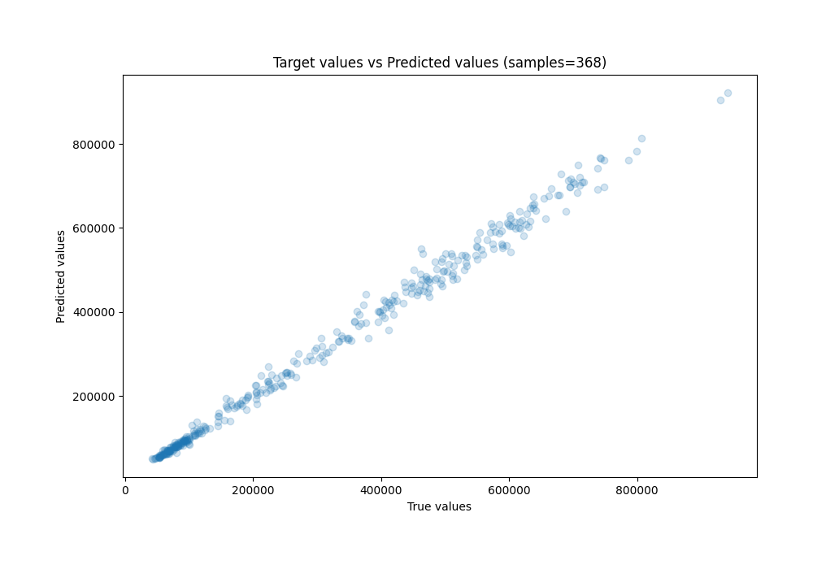
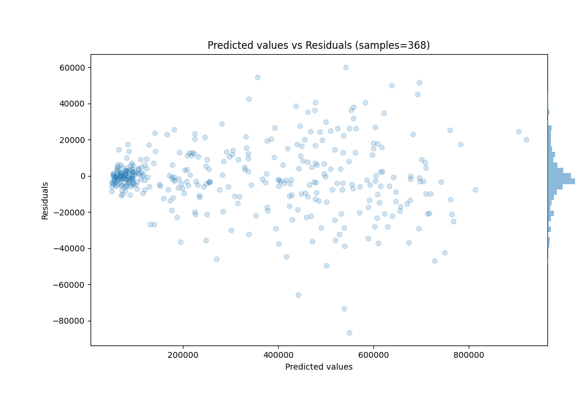

# Summary of 13_Xgboost_categorical_mix

[<< Go back](../README.md)

## Extreme Gradient Boosting (Xgboost)
- **n_jobs**: -1
- **objective**: reg:squarederror
- **eta**: 0.05
- **max_depth**: 8
- **min_child_weight**: 5
- **subsample**: 0.5
- **colsample_bytree**: 0.8
- **eval_metric**: rmse
- **explain_level**: 1

## Validation
 - **validation_type**: split
 - **train_ratio**: 0.8
 - **shuffle**: False

## Optimized metric
rmse

## Training time

3.5 seconds

### Metric details:
| Metric   |           Score |
|:---------|----------------:|
| MAE      | 12297           |
| MSE      |     3.24812e+08 |
| RMSE     | 18022.5         |
| R2       |     0.993551    |
| MAPE     |     0.0444417   |

## Learning curves

## Permutation-based Importance

## True vs Predicted

## Predicted vs Residuals

[<< Go back](../README.md)
