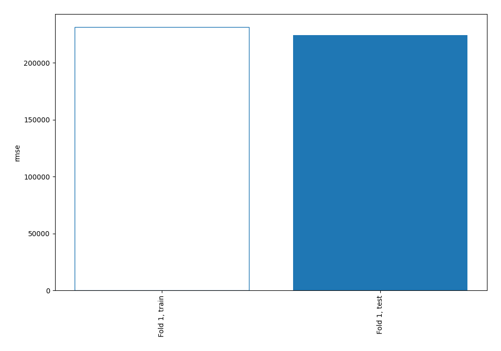
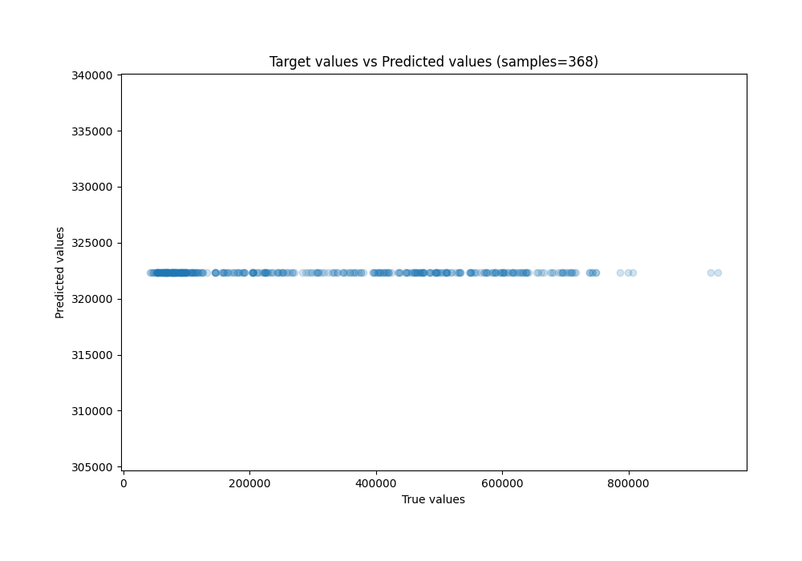
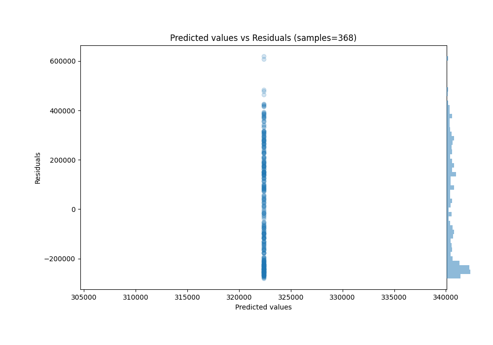

# Summary of 1_Baseline

[<< Go back](../README.md)

## Baseline Regressor (Baseline)
- **n_jobs**: -1
- **explain_level**: 1

## Validation
 - **validation_type**: split
 - **train_ratio**: 0.8
 - **shuffle**: False

## Optimized metric
rmse

## Training time

0.2 seconds

### Metric details:
| Metric   |            Score |
|:---------|-----------------:|
| MAE      | 199845           |
| MSE      |      5.03675e+10 |
| RMSE     | 224427           |
| R2       |     -1.83628e-05 |
| MAPE     |      1.35767     |

## Learning curves

## True vs Predicted

## Predicted vs Residuals

[<< Go back](../README.md)
