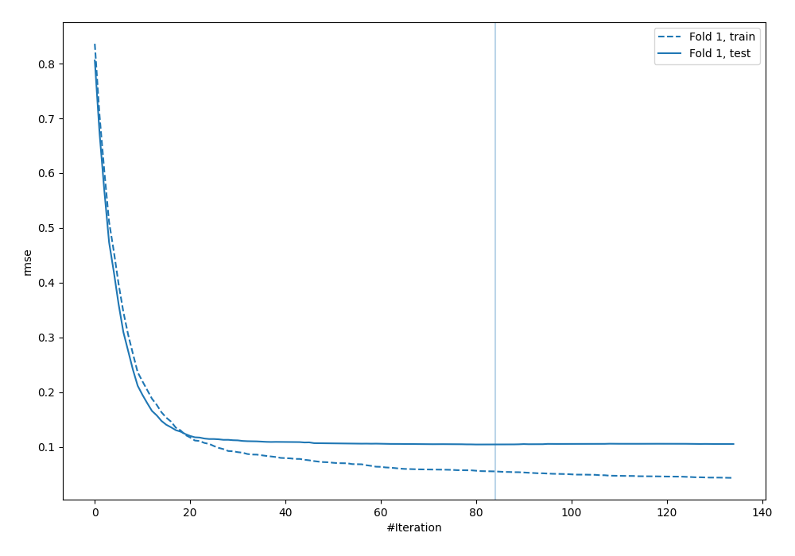
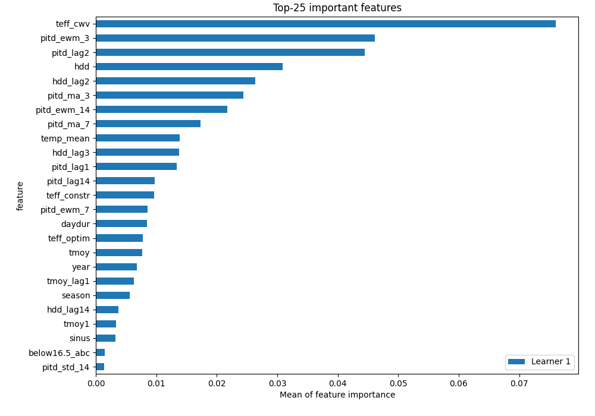
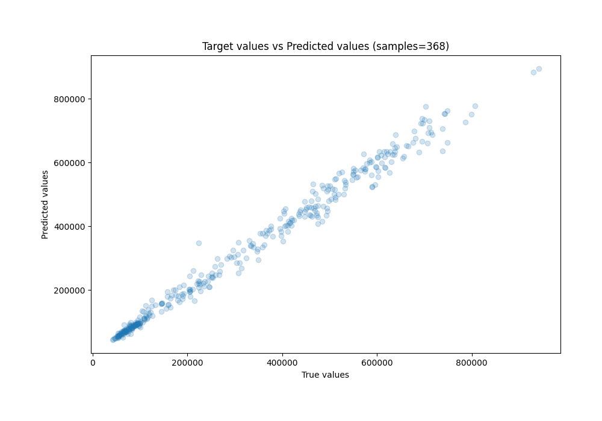
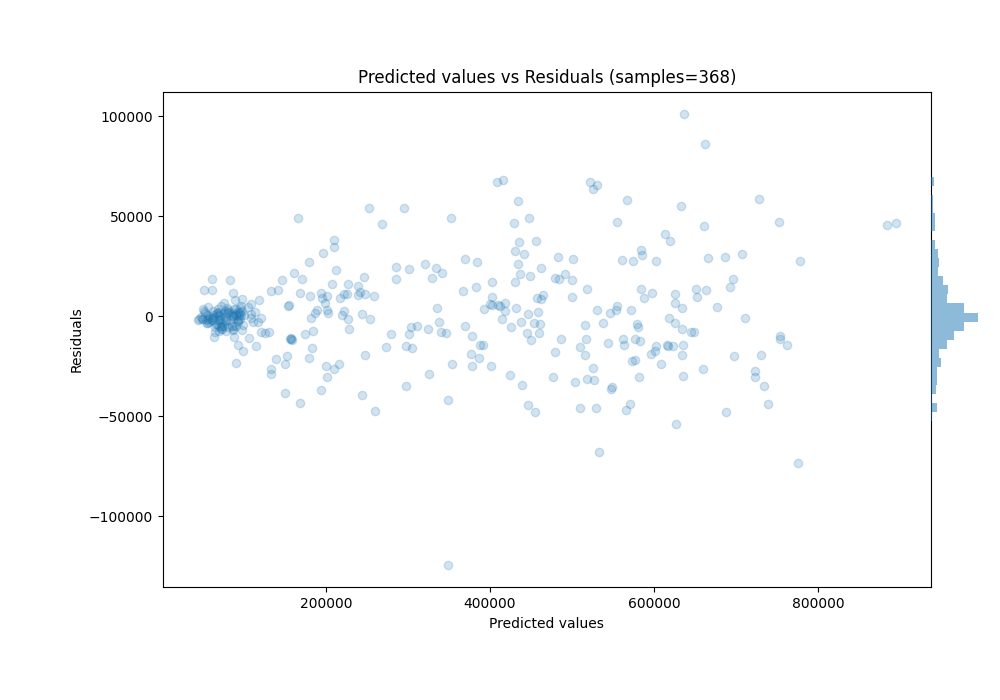

# Summary of 28_CatBoost

[<< Go back](../README.md)

## CatBoost
- **n_jobs**: -1
- **learning_rate**: 0.2
- **depth**: 8
- **rsm**: 1.0
- **loss_function**: MAE
- **eval_metric**: RMSE
- **explain_level**: 1

## Validation
 - **validation_type**: split
 - **train_ratio**: 0.8
 - **shuffle**: False

## Optimized metric
rmse

## Training time

7.4 seconds

### Metric details:
| Metric   |           Score |
|:---------|----------------:|
| MAE      | 16581           |
| MSE      |     5.85427e+08 |
| RMSE     | 24195.6         |
| R2       |     0.988377    |
| MAPE     |     0.0594826   |

## Learning curves

## Permutation-based Importance

## True vs Predicted

## Predicted vs Residuals

[<< Go back](../README.md)
