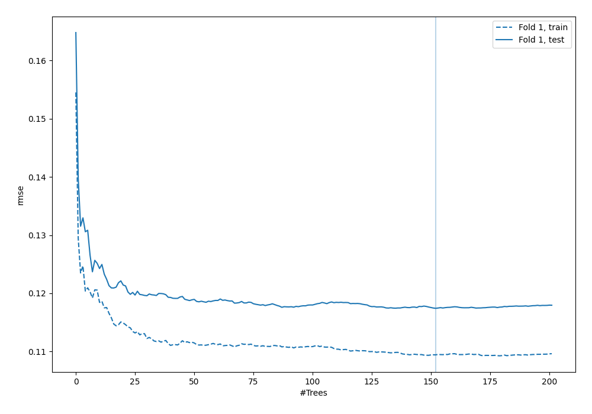
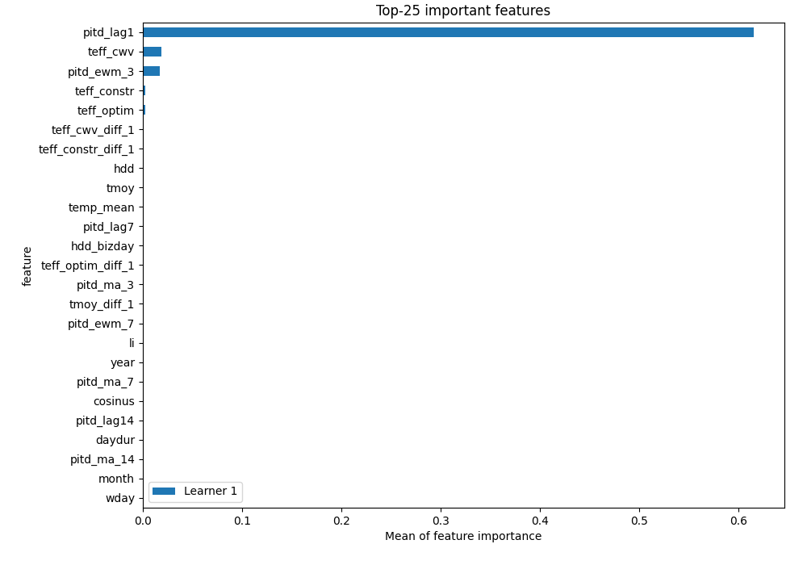
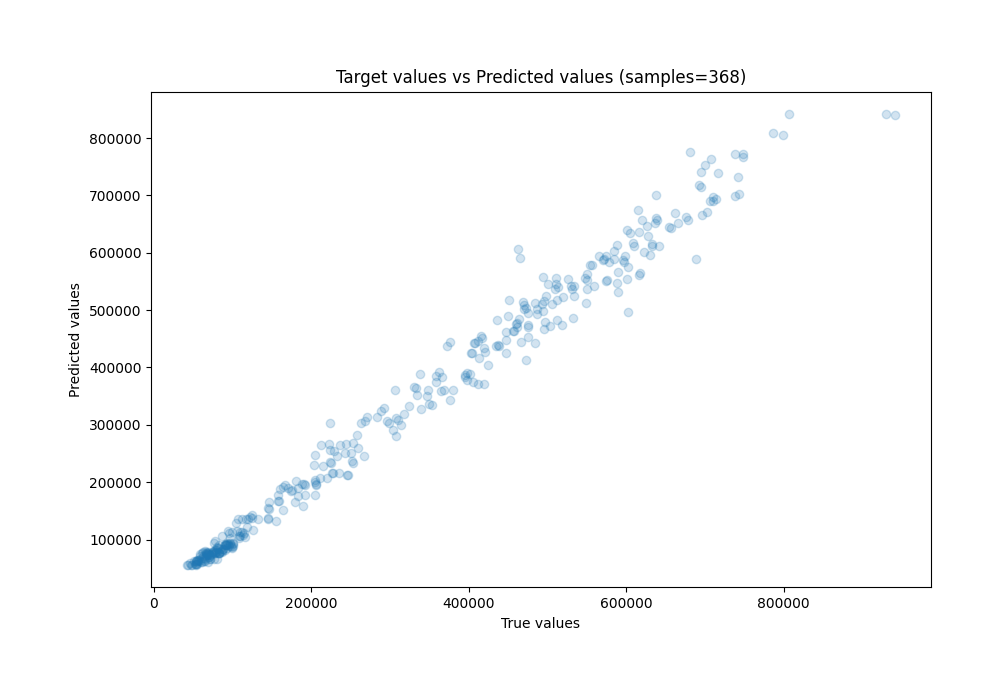
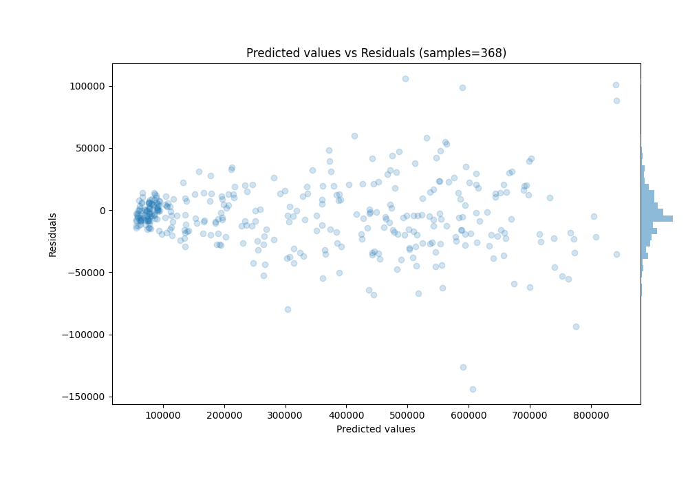

# Summary of 37_RandomForest

[<< Go back](../README.md)

## Random Forest
- **n_jobs**: -1
- **criterion**: squared_error
- **max_features**: 0.6
- **min_samples_split**: 50
- **max_depth**: 6
- **eval_metric_name**: rmse
- **explain_level**: 1

## Validation
 - **validation_type**: split
 - **train_ratio**: 0.8
 - **shuffle**: False

## Optimized metric
rmse

## Training time

6.9 seconds

### Metric details:
| Metric   |           Score |
|:---------|----------------:|
| MAE      | 18953.1         |
| MSE      |     7.38773e+08 |
| RMSE     | 27180.4         |
| R2       |     0.985332    |
| MAPE     |     0.0734706   |

## Learning curves

## Permutation-based Importance

## True vs Predicted

## Predicted vs Residuals

[<< Go back](../README.md)
