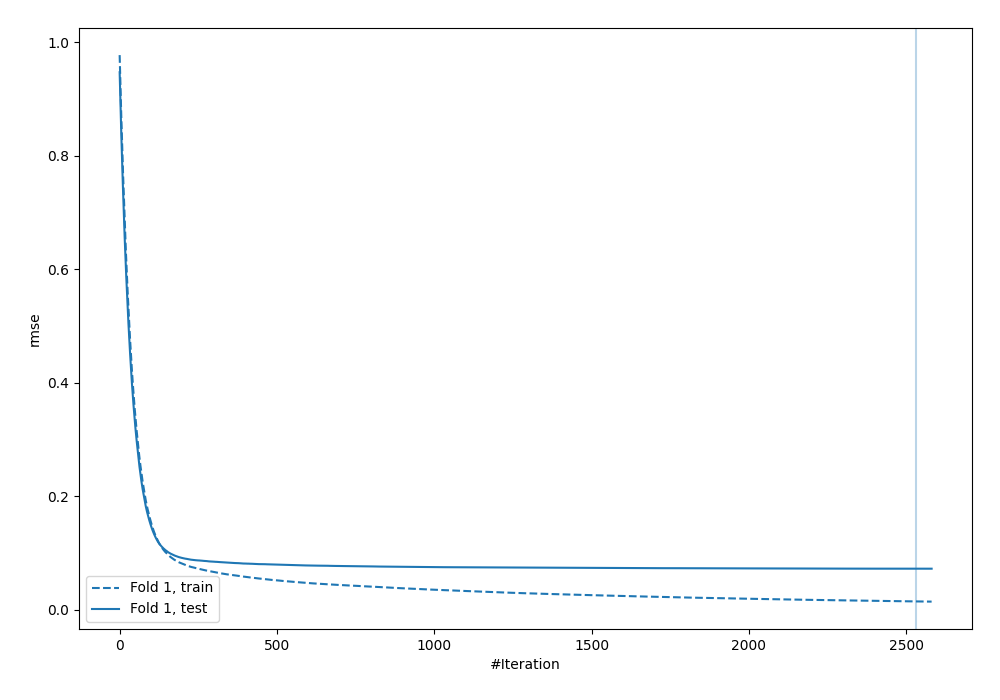
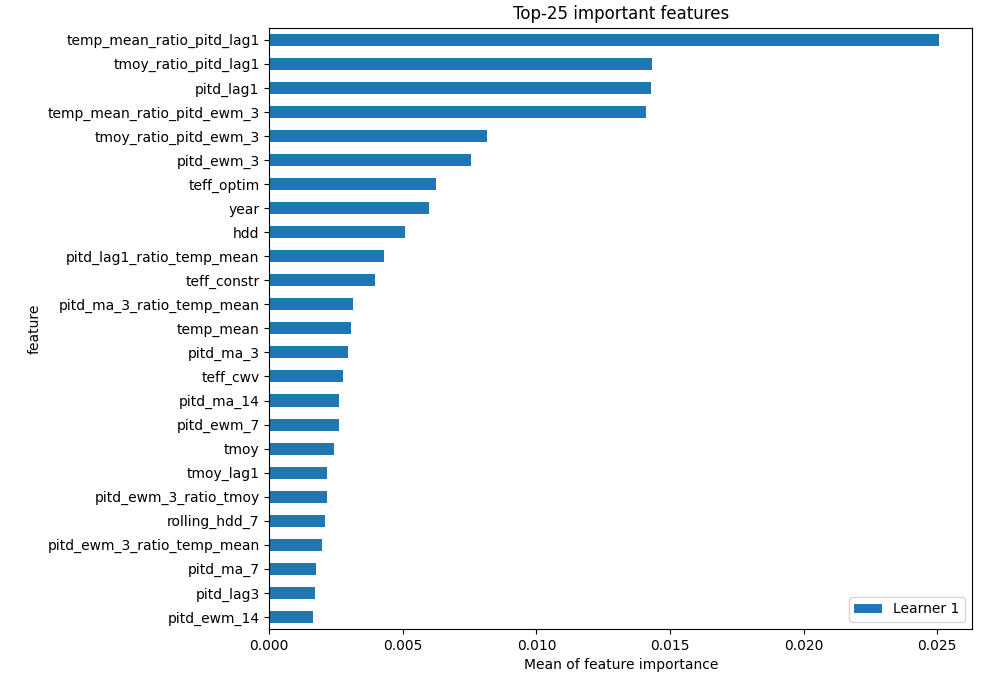
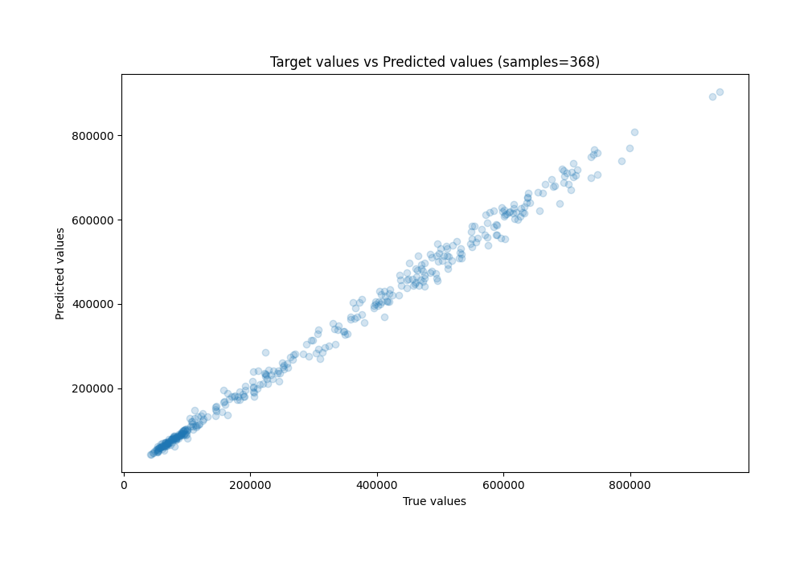
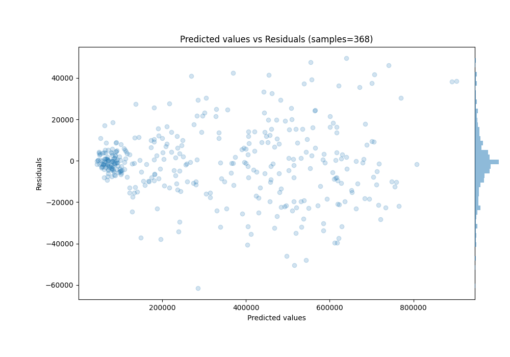

# Summary of 53_CatBoost_GoldenFeatures_SelectedFeatures

[<< Go back](../README.md)

## CatBoost
- **n_jobs**: -1
- **learning_rate**: 0.025
- **depth**: 6
- **rsm**: 0.7
- **loss_function**: RMSE
- **eval_metric**: RMSE
- **explain_level**: 1

## Validation
 - **validation_type**: split
 - **train_ratio**: 0.8
 - **shuffle**: False

## Optimized metric
rmse

## Training time

56.9 seconds

### Metric details:
| Metric   |           Score |
|:---------|----------------:|
| MAE      | 11963.3         |
| MSE      |     2.81949e+08 |
| RMSE     | 16791.3         |
| R2       |     0.994402    |
| MAPE     |     0.0445417   |

## Learning curves

## Permutation-based Importance

## True vs Predicted

## Predicted vs Residuals

[<< Go back](../README.md)
