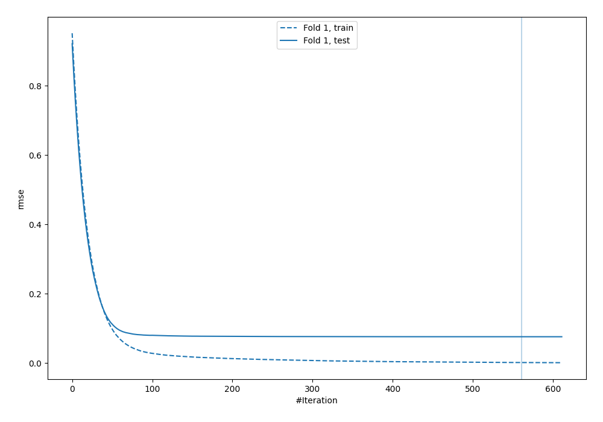
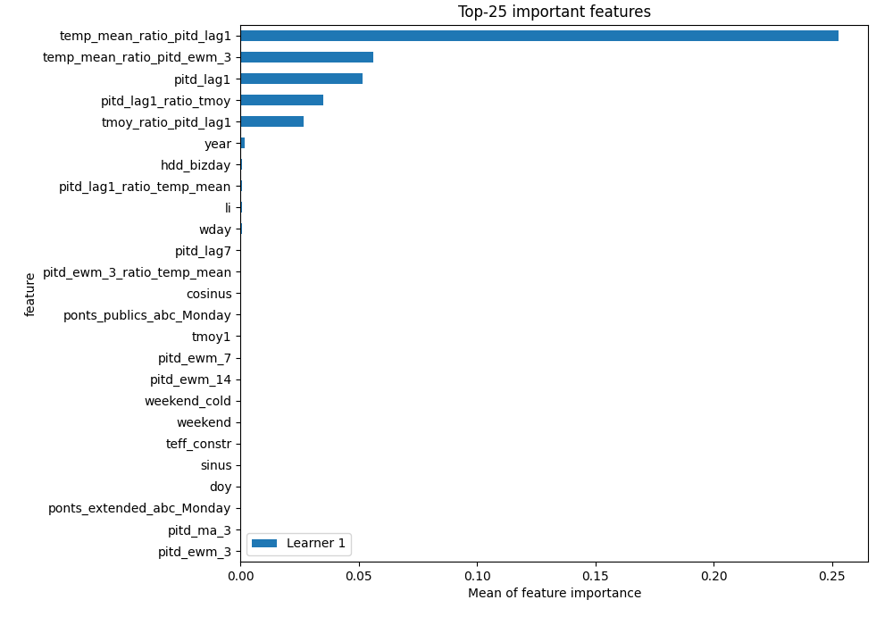
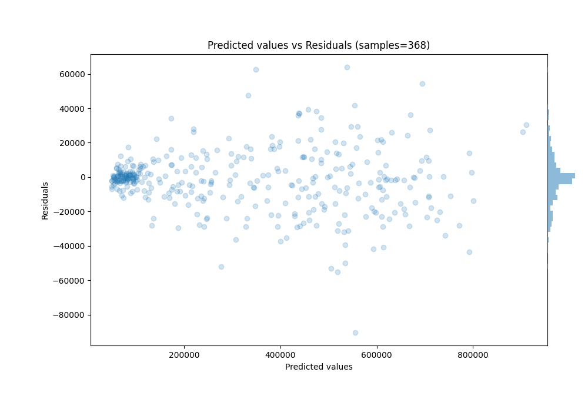

# Summary of 57_Xgboost_GoldenFeatures

[<< Go back](../README.md)

## Extreme Gradient Boosting (Xgboost)
- **n_jobs**: -1
- **objective**: reg:squarederror
- **eta**: 0.05
- **max_depth**: 8
- **min_child_weight**: 5
- **subsample**: 0.6
- **colsample_bytree**: 0.8
- **eval_metric**: rmse
- **explain_level**: 1

## Validation
 - **validation_type**: split
 - **train_ratio**: 0.8
 - **shuffle**: False

## Optimized metric
rmse

## Training time

6.4 seconds

### Metric details:
| Metric   |           Score |
|:---------|----------------:|
| MAE      | 12160           |
| MSE      |     3.11832e+08 |
| RMSE     | 17658.8         |
| R2       |     0.993809    |
| MAPE     |     0.0436642   |

## Learning curves

## Permutation-based Importance

## True vs Predicted

## Predicted vs Residuals

[<< Go back](../README.md)
