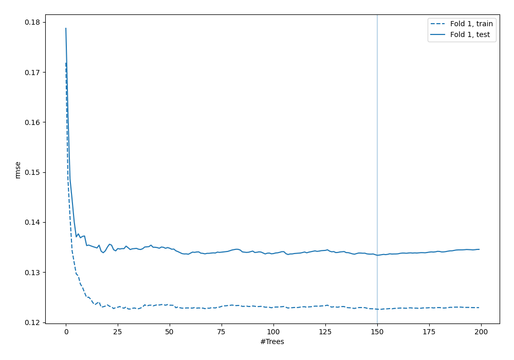
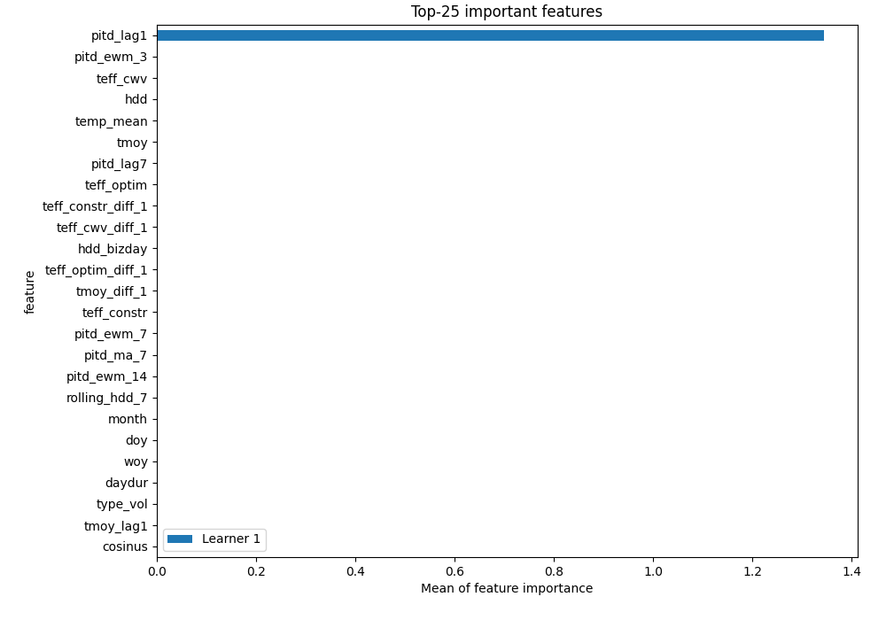
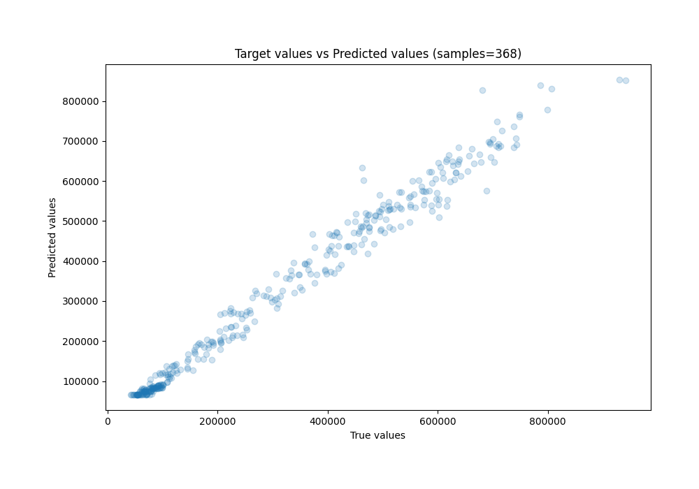
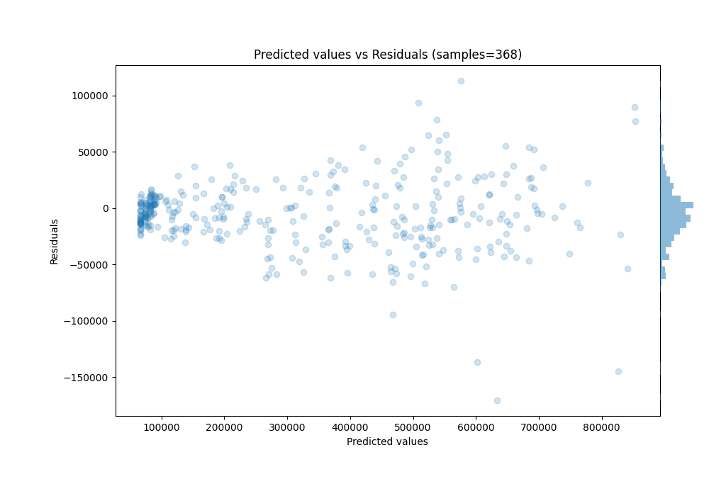

# Summary of 5_Default_RandomForest

[<< Go back](../README.md)

## Random Forest
- **n_jobs**: -1
- **criterion**: squared_error
- **max_features**: 0.9
- **min_samples_split**: 30
- **max_depth**: 4
- **eval_metric_name**: rmse
- **explain_level**: 1

## Validation
 - **validation_type**: split
 - **train_ratio**: 0.8
 - **shuffle**: False

## Optimized metric
rmse

## Training time

5.2 seconds

### Metric details:
| Metric   |           Score |
|:---------|----------------:|
| MAE      | 21801           |
| MSE      |     9.53115e+08 |
| RMSE     | 30872.6         |
| R2       |     0.981076    |
| MAPE     |     0.0899482   |

## Learning curves

## Permutation-based Importance

## True vs Predicted

## Predicted vs Residuals

[<< Go back](../README.md)
