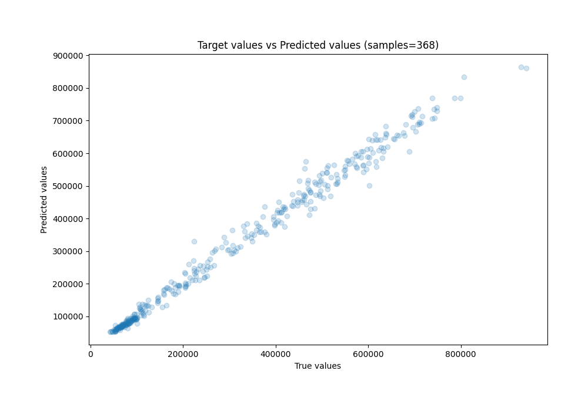
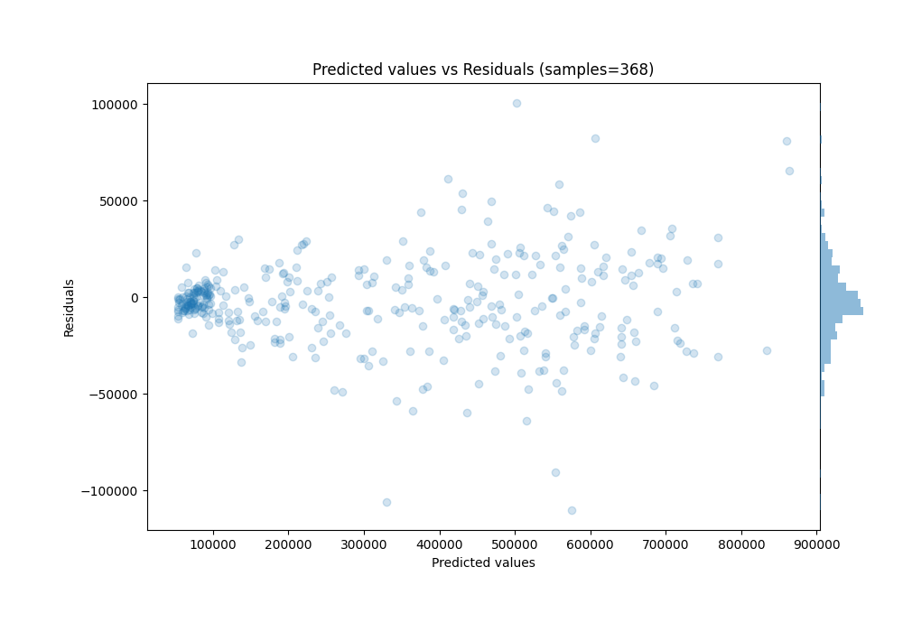

# Summary of 69_ExtraTrees

[<< Go back](../README.md)

## Extra Trees Regressor (Extra Trees)
- **n_jobs**: -1
- **criterion**: squared_error
- **max_features**: 0.6
- **min_samples_split**: 30
- **max_depth**: 7
- **eval_metric_name**: rmse
- **explain_level**: 1

## Validation
 - **validation_type**: split
 - **train_ratio**: 0.8
 - **shuffle**: False

## Optimized metric
rmse

## Training time

6.8 seconds

### Metric details:
| Metric   |           Score |
|:---------|----------------:|
| MAE      | 16393.8         |
| MSE      |     5.55962e+08 |
| RMSE     | 23578.8         |
| R2       |     0.988962    |
| MAPE     |     0.0620802   |

## Learning curves

## Permutation-based Importance

## True vs Predicted

## Predicted vs Residuals

[<< Go back](../README.md)
