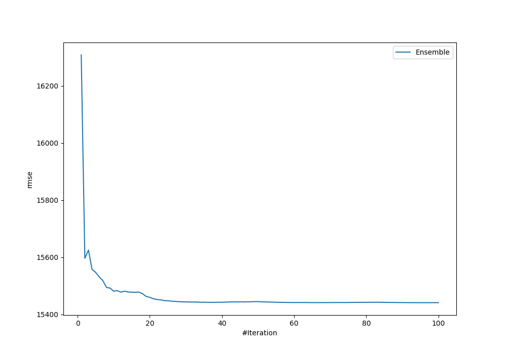
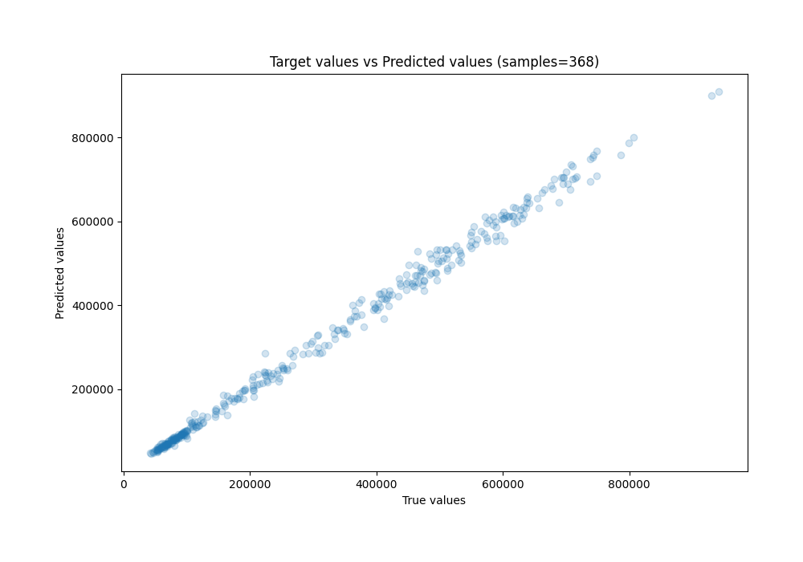
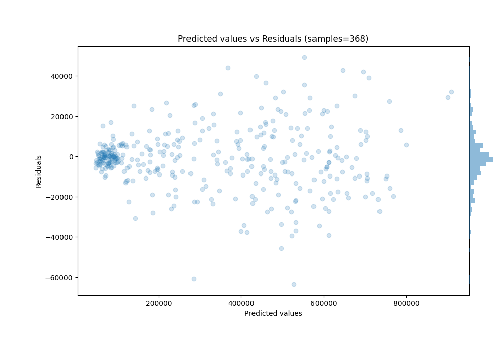

# Summary of Ensemble

[<< Go back](../README.md)

## Ensemble structure
| Model                                                      |   Weight |
|:-----------------------------------------------------------|---------:|
| 10_Xgboost                                                 |        2 |
| 13_Xgboost_categorical_mix_GoldenFeatures_SelectedFeatures |       14 |
| 33_CatBoost_KMeansFeatures                                 |       10 |
| 35_RandomForest                                            |        3 |
| 55_CatBoost_GoldenFeatures                                 |        1 |
| 75_CatBoost_GoldenFeatures                                 |        3 |
| 76_CatBoost_GoldenFeatures_SelectedFeatures                |       35 |
| 79_Xgboost_GoldenFeatures                                  |       23 |
| 82_LightGBM                                                |        5 |

### Metric details:
| Metric   |           Score |
|:---------|----------------:|
| MAE      | 10839.7         |
| MSE      |     2.38442e+08 |
| RMSE     | 15441.6         |
| R2       |     0.995266    |
| MAPE     |     0.0399601   |

## Learning curves

## True vs Predicted

## Predicted vs Residuals

[<< Go back](../README.md)
