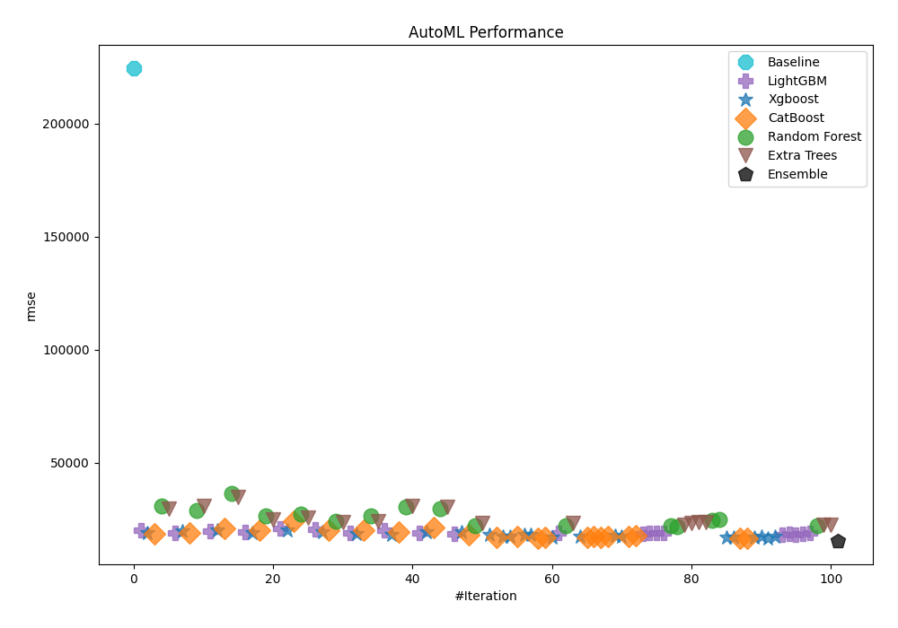
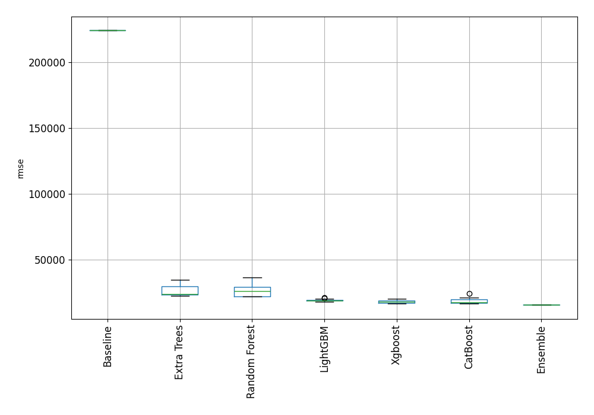
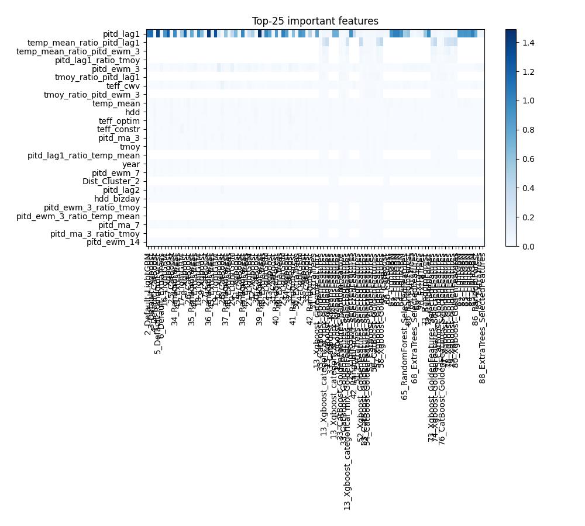
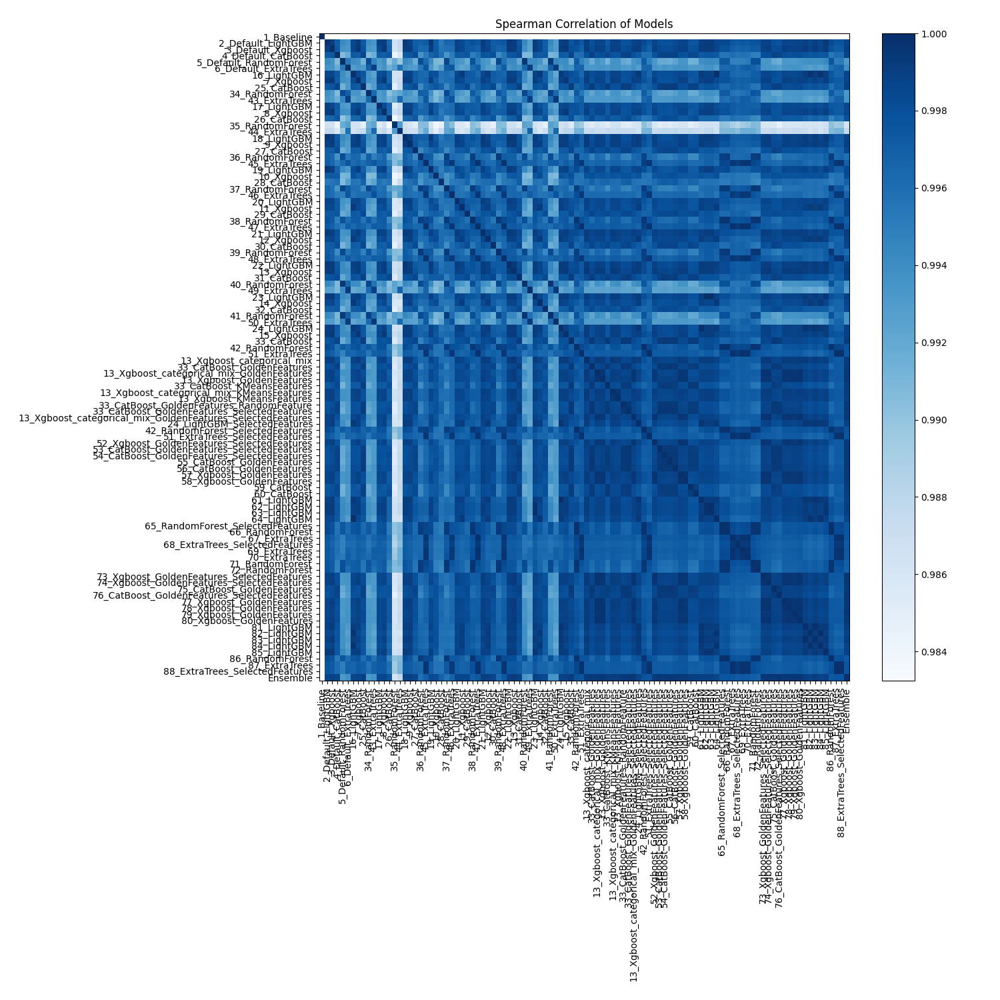

# AutoML Leaderboard

| Best model   | name                                                                                                                               | model_type    | metric_type   |   metric_value |   train_time |
|:-------------|:-----------------------------------------------------------------------------------------------------------------------------------|:--------------|:--------------|---------------:|-------------:|
|              | [1_Baseline](1_Baseline/README.md)                                                                                                 | Baseline      | rmse          |       224427   |         0.44 |
|              | [2_Default_LightGBM](2_Default_LightGBM/README.md)                                                                                 | LightGBM      | rmse          |        20231.9 |        10.17 |
|              | [3_Default_Xgboost](3_Default_Xgboost/README.md)                                                                                   | Xgboost       | rmse          |        18730.7 |         4.05 |
|              | [4_Default_CatBoost](4_Default_CatBoost/README.md)                                                                                 | CatBoost      | rmse          |        18662.4 |        23.92 |
|              | [5_Default_RandomForest](5_Default_RandomForest/README.md)                                                                         | Random Forest | rmse          |        30872.6 |         5.62 |
|              | [6_Default_ExtraTrees](6_Default_ExtraTrees/README.md)                                                                             | Extra Trees   | rmse          |        29627.9 |         3.03 |
|              | [16_LightGBM](16_LightGBM/README.md)                                                                                               | LightGBM      | rmse          |        18876.1 |         2.03 |
|              | [7_Xgboost](7_Xgboost/README.md)                                                                                                   | Xgboost       | rmse          |        19778.1 |         3.18 |
|              | [25_CatBoost](25_CatBoost/README.md)                                                                                               | CatBoost      | rmse          |        18955.9 |        28.84 |
|              | [34_RandomForest](34_RandomForest/README.md)                                                                                       | Random Forest | rmse          |        28720   |         2.23 |
|              | [43_ExtraTrees](43_ExtraTrees/README.md)                                                                                           | Extra Trees   | rmse          |        30706.8 |         3.62 |
|              | [17_LightGBM](17_LightGBM/README.md)                                                                                               | LightGBM      | rmse          |        19692.4 |         2.05 |
|              | [8_Xgboost](8_Xgboost/README.md)                                                                                                   | Xgboost       | rmse          |        19865.9 |         3    |
|              | [26_CatBoost](26_CatBoost/README.md)                                                                                               | CatBoost      | rmse          |        20977.1 |        30.11 |
|              | [35_RandomForest](35_RandomForest/README.md)                                                                                       | Random Forest | rmse          |        36339.9 |         3.29 |
|              | [44_ExtraTrees](44_ExtraTrees/README.md)                                                                                           | Extra Trees   | rmse          |        34706.7 |         4.78 |
|              | [18_LightGBM](18_LightGBM/README.md)                                                                                               | LightGBM      | rmse          |        19208   |         3.34 |
|              | [9_Xgboost](9_Xgboost/README.md)                                                                                                   | Xgboost       | rmse          |        18690.7 |         2.13 |
|              | [27_CatBoost](27_CatBoost/README.md)                                                                                               | CatBoost      | rmse          |        19979.3 |        26.96 |
|              | [36_RandomForest](36_RandomForest/README.md)                                                                                       | Random Forest | rmse          |        26551.3 |         2.56 |
|              | [45_ExtraTrees](45_ExtraTrees/README.md)                                                                                           | Extra Trees   | rmse          |        24831.2 |         5.59 |
|              | [19_LightGBM](19_LightGBM/README.md)                                                                                               | LightGBM      | rmse          |        21039.4 |         4.85 |
|              | [10_Xgboost](10_Xgboost/README.md)                                                                                                 | Xgboost       | rmse          |        20136.7 |         2.23 |
|              | [28_CatBoost](28_CatBoost/README.md)                                                                                               | CatBoost      | rmse          |        24195.6 |         7.93 |
|              | [37_RandomForest](37_RandomForest/README.md)                                                                                       | Random Forest | rmse          |        27180.4 |         7.37 |
|              | [46_ExtraTrees](46_ExtraTrees/README.md)                                                                                           | Extra Trees   | rmse          |        25686.7 |         3.45 |
|              | [20_LightGBM](20_LightGBM/README.md)                                                                                               | LightGBM      | rmse          |        20632.4 |         1.76 |
|              | [11_Xgboost](11_Xgboost/README.md)                                                                                                 | Xgboost       | rmse          |        19374.2 |         2.15 |
|              | [29_CatBoost](29_CatBoost/README.md)                                                                                               | CatBoost      | rmse          |        20066.1 |        15.91 |
|              | [38_RandomForest](38_RandomForest/README.md)                                                                                       | Random Forest | rmse          |        23939.4 |         2.95 |
|              | [47_ExtraTrees](47_ExtraTrees/README.md)                                                                                           | Extra Trees   | rmse          |        23606.9 |         5.2  |
|              | [21_LightGBM](21_LightGBM/README.md)                                                                                               | LightGBM      | rmse          |        18923.2 |         3.65 |
|              | [12_Xgboost](12_Xgboost/README.md)                                                                                                 | Xgboost       | rmse          |        18492.3 |         2.11 |
|              | [30_CatBoost](30_CatBoost/README.md)                                                                                               | CatBoost      | rmse          |        20094.8 |        11.78 |
|              | [39_RandomForest](39_RandomForest/README.md)                                                                                       | Random Forest | rmse          |        26576.7 |         5.19 |
|              | [48_ExtraTrees](48_ExtraTrees/README.md)                                                                                           | Extra Trees   | rmse          |        23898.4 |         3.51 |
|              | [22_LightGBM](22_LightGBM/README.md)                                                                                               | LightGBM      | rmse          |        19927.3 |         1.98 |
|              | [13_Xgboost](13_Xgboost/README.md)                                                                                                 | Xgboost       | rmse          |        18061.5 |         3.13 |
|              | [31_CatBoost](31_CatBoost/README.md)                                                                                               | CatBoost      | rmse          |        19253.6 |        74.34 |
|              | [40_RandomForest](40_RandomForest/README.md)                                                                                       | Random Forest | rmse          |        30217.1 |         6.63 |
|              | [49_ExtraTrees](49_ExtraTrees/README.md)                                                                                           | Extra Trees   | rmse          |        30895.6 |         3.95 |
|              | [23_LightGBM](23_LightGBM/README.md)                                                                                               | LightGBM      | rmse          |        18698.5 |         3.42 |
|              | [14_Xgboost](14_Xgboost/README.md)                                                                                                 | Xgboost       | rmse          |        19439.3 |         2.12 |
|              | [32_CatBoost](32_CatBoost/README.md)                                                                                               | CatBoost      | rmse          |        21205.8 |        21.69 |
|              | [41_RandomForest](41_RandomForest/README.md)                                                                                       | Random Forest | rmse          |        29723   |         3.33 |
|              | [50_ExtraTrees](50_ExtraTrees/README.md)                                                                                           | Extra Trees   | rmse          |        30456.9 |         3.92 |
|              | [24_LightGBM](24_LightGBM/README.md)                                                                                               | LightGBM      | rmse          |        18649.2 |         3.4  |
|              | [15_Xgboost](15_Xgboost/README.md)                                                                                                 | Xgboost       | rmse          |        19118.3 |         3.53 |
|              | [33_CatBoost](33_CatBoost/README.md)                                                                                               | CatBoost      | rmse          |        17947.9 |        91.97 |
|              | [42_RandomForest](42_RandomForest/README.md)                                                                                       | Random Forest | rmse          |        21914.6 |         6.59 |
|              | [51_ExtraTrees](51_ExtraTrees/README.md)                                                                                           | Extra Trees   | rmse          |        23076.9 |        10.8  |
|              | [13_Xgboost_categorical_mix](13_Xgboost_categorical_mix/README.md)                                                                 | Xgboost       | rmse          |        18022.5 |         3.91 |
|              | [33_CatBoost_GoldenFeatures](33_CatBoost_GoldenFeatures/README.md)                                                                 | CatBoost      | rmse          |        16944.9 |        70.69 |
|              | [13_Xgboost_categorical_mix_GoldenFeatures](13_Xgboost_categorical_mix_GoldenFeatures/README.md)                                   | Xgboost       | rmse          |        17101.9 |         5.04 |
|              | [13_Xgboost_GoldenFeatures](13_Xgboost_GoldenFeatures/README.md)                                                                   | Xgboost       | rmse          |        17295.2 |         4.64 |
|              | [33_CatBoost_KMeansFeatures](33_CatBoost_KMeansFeatures/README.md)                                                                 | CatBoost      | rmse          |        17341.9 |       139.25 |
|              | [13_Xgboost_categorical_mix_KMeansFeatures](13_Xgboost_categorical_mix_KMeansFeatures/README.md)                                   | Xgboost       | rmse          |        18067.3 |         6.51 |
|              | [13_Xgboost_KMeansFeatures](13_Xgboost_KMeansFeatures/README.md)                                                                   | Xgboost       | rmse          |        18164   |         4.93 |
|              | [33_CatBoost_GoldenFeatures_RandomFeature](33_CatBoost_GoldenFeatures_RandomFeature/README.md)                                     | CatBoost      | rmse          |        16618.2 |        52.24 |
|              | [33_CatBoost_GoldenFeatures_SelectedFeatures](33_CatBoost_GoldenFeatures_SelectedFeatures/README.md)                               | CatBoost      | rmse          |        16913.2 |        71.12 |
|              | [13_Xgboost_categorical_mix_GoldenFeatures_SelectedFeatures](13_Xgboost_categorical_mix_GoldenFeatures_SelectedFeatures/README.md) | Xgboost       | rmse          |        16692.8 |         5.82 |
|              | [24_LightGBM_SelectedFeatures](24_LightGBM_SelectedFeatures/README.md)                                                             | LightGBM      | rmse          |        19005.8 |         2.49 |
|              | [42_RandomForest_SelectedFeatures](42_RandomForest_SelectedFeatures/README.md)                                                     | Random Forest | rmse          |        21880   |         4.98 |
|              | [51_ExtraTrees_SelectedFeatures](51_ExtraTrees_SelectedFeatures/README.md)                                                         | Extra Trees   | rmse          |        23159.3 |         4.22 |
|              | [52_Xgboost_GoldenFeatures_SelectedFeatures](52_Xgboost_GoldenFeatures_SelectedFeatures/README.md)                                 | Xgboost       | rmse          |        17398   |         5.91 |
|              | [53_CatBoost_GoldenFeatures_SelectedFeatures](53_CatBoost_GoldenFeatures_SelectedFeatures/README.md)                               | CatBoost      | rmse          |        16791.3 |        57.34 |
|              | [54_CatBoost_GoldenFeatures_SelectedFeatures](54_CatBoost_GoldenFeatures_SelectedFeatures/README.md)                               | CatBoost      | rmse          |        17326.2 |       107.31 |
|              | [55_CatBoost_GoldenFeatures](55_CatBoost_GoldenFeatures/README.md)                                                                 | CatBoost      | rmse          |        16757.1 |        51.38 |
|              | [56_CatBoost_GoldenFeatures](56_CatBoost_GoldenFeatures/README.md)                                                                 | CatBoost      | rmse          |        17372.1 |        96.87 |
|              | [57_Xgboost_GoldenFeatures](57_Xgboost_GoldenFeatures/README.md)                                                                   | Xgboost       | rmse          |        17658.8 |         6.86 |
|              | [58_Xgboost_GoldenFeatures](58_Xgboost_GoldenFeatures/README.md)                                                                   | Xgboost       | rmse          |        17357.4 |         7.35 |
|              | [59_CatBoost](59_CatBoost/README.md)                                                                                               | CatBoost      | rmse          |        17468.5 |        43.68 |
|              | [60_CatBoost](60_CatBoost/README.md)                                                                                               | CatBoost      | rmse          |        17698.4 |       180.05 |
|              | [61_LightGBM](61_LightGBM/README.md)                                                                                               | LightGBM      | rmse          |        18649.2 |         3.59 |
|              | [62_LightGBM](62_LightGBM/README.md)                                                                                               | LightGBM      | rmse          |        18698.5 |         3.57 |
|              | [63_LightGBM](63_LightGBM/README.md)                                                                                               | LightGBM      | rmse          |        18698.5 |         3.56 |
|              | [64_LightGBM](64_LightGBM/README.md)                                                                                               | LightGBM      | rmse          |        18876.1 |         2.41 |
|              | [65_RandomForest_SelectedFeatures](65_RandomForest_SelectedFeatures/README.md)                                                     | Random Forest | rmse          |        22115.9 |         5.18 |
|              | [66_RandomForest](66_RandomForest/README.md)                                                                                       | Random Forest | rmse          |        21809.6 |         8.82 |
|              | [67_ExtraTrees](67_ExtraTrees/README.md)                                                                                           | Extra Trees   | rmse          |        22542.3 |         4.73 |
|              | [68_ExtraTrees_SelectedFeatures](68_ExtraTrees_SelectedFeatures/README.md)                                                         | Extra Trees   | rmse          |        23128.7 |         2.66 |
|              | [69_ExtraTrees](69_ExtraTrees/README.md)                                                                                           | Extra Trees   | rmse          |        23578.8 |         7.24 |
|              | [70_ExtraTrees](70_ExtraTrees/README.md)                                                                                           | Extra Trees   | rmse          |        23482.8 |         4.62 |
|              | [71_RandomForest](71_RandomForest/README.md)                                                                                       | Random Forest | rmse          |        24538.4 |         4.96 |
|              | [72_RandomForest](72_RandomForest/README.md)                                                                                       | Random Forest | rmse          |        24949.1 |         3.22 |
|              | [73_Xgboost_GoldenFeatures_SelectedFeatures](73_Xgboost_GoldenFeatures_SelectedFeatures/README.md)                                 | Xgboost       | rmse          |        16842.5 |         5.13 |
|              | [74_Xgboost_GoldenFeatures_SelectedFeatures](74_Xgboost_GoldenFeatures_SelectedFeatures/README.md)                                 | Xgboost       | rmse          |        16984.1 |         6.16 |
|              | [75_CatBoost_GoldenFeatures](75_CatBoost_GoldenFeatures/README.md)                                                                 | CatBoost      | rmse          |        16629.1 |        40.05 |
|              | [76_CatBoost_GoldenFeatures_SelectedFeatures](76_CatBoost_GoldenFeatures_SelectedFeatures/README.md)                               | CatBoost      | rmse          |        16308.2 |        42.93 |
|              | [77_Xgboost_GoldenFeatures](77_Xgboost_GoldenFeatures/README.md)                                                                   | Xgboost       | rmse          |        16901.7 |         5.92 |
|              | [78_Xgboost_GoldenFeatures](78_Xgboost_GoldenFeatures/README.md)                                                                   | Xgboost       | rmse          |        17148.1 |         5.2  |
|              | [79_Xgboost_GoldenFeatures](79_Xgboost_GoldenFeatures/README.md)                                                                   | Xgboost       | rmse          |        16560.7 |         5.33 |
|              | [80_Xgboost_GoldenFeatures](80_Xgboost_GoldenFeatures/README.md)                                                                   | Xgboost       | rmse          |        17231   |         6.65 |
|              | [81_LightGBM](81_LightGBM/README.md)                                                                                               | LightGBM      | rmse          |        18033.2 |         3    |
|              | [82_LightGBM](82_LightGBM/README.md)                                                                                               | LightGBM      | rmse          |        18567.9 |         3.06 |
|              | [83_LightGBM](83_LightGBM/README.md)                                                                                               | LightGBM      | rmse          |        18033.2 |         3.02 |
|              | [84_LightGBM](84_LightGBM/README.md)                                                                                               | LightGBM      | rmse          |        18567.9 |         3.05 |
|              | [85_LightGBM](85_LightGBM/README.md)                                                                                               | LightGBM      | rmse          |        19046   |         2.54 |
|              | [86_RandomForest](86_RandomForest/README.md)                                                                                       | Random Forest | rmse          |        21940.7 |        10.61 |
|              | [87_ExtraTrees](87_ExtraTrees/README.md)                                                                                           | Extra Trees   | rmse          |        22604.4 |         5.25 |
|              | [88_ExtraTrees_SelectedFeatures](88_ExtraTrees_SelectedFeatures/README.md)                                                         | Extra Trees   | rmse          |        22535.7 |         4.79 |
| **the best** | [Ensemble](Ensemble/README.md)                                                                                                     | Ensemble      | rmse          |        15441.6 |        15.69 |

### AutoML Performance

### AutoML Performance Boxplot

### Features Importance

### Spearman Correlation of Models

